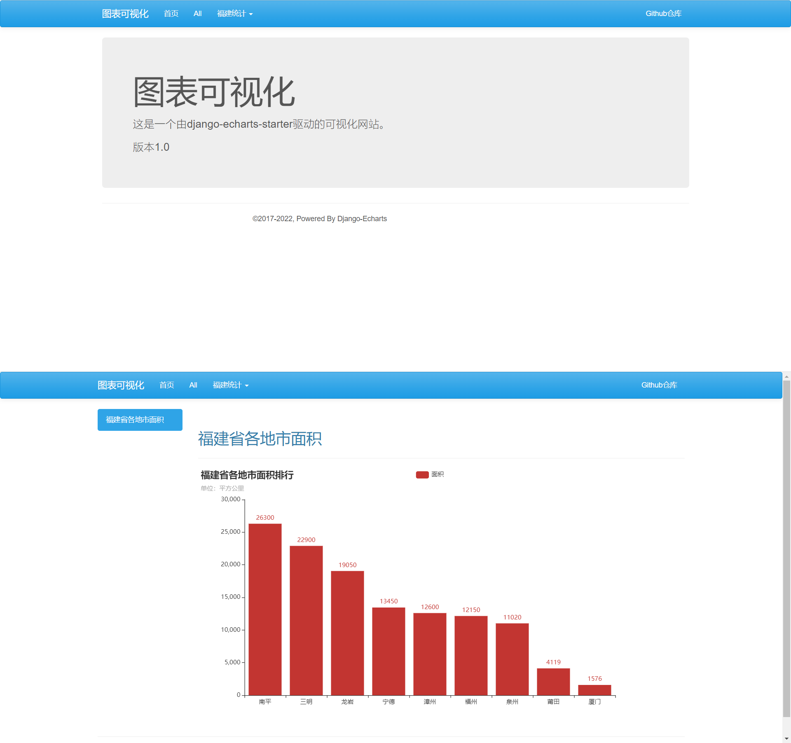

# django-echarts

 [](https://travis-ci.org/kinegratii/django-echarts)   


> A site generator based on [pyecharts](https://github.com/pyecharts/pyecharts) and [pyecharts](https://github.com/pyecharts/pyecharts).

## Summary

> django-echarts v0.5.0b1 has been released.The v0.5.0 will release in April.2022.

django-echarts contains the following features:

- Pages: Home / List / Detail / About
- Components: Nav / Footer / Top Charts / List 
- Themes: Bootstrap3 / Material
- The render engine based on Django Template Engine
- js/css dependency manger
- Code Generator
- 90%+ Python Typing Hints

## Installation

django-echarts runs in the following environment:

| django-echarts | pyecharts | django | python | Remark |
| ------ | ------ | ------ | ----- | ----- |
| 0.5.x | 1.9+ | 2.0+ | 3.7+ | In development |

> Note django-echarts v0.3.x will not be maintained.

You can install with *pip* command.

```shell
pip install django-echarts==0.5.0b1
```

## Quickstart in 3 Minutes

1 Create Django project with *startproject* command.

```shell
django-admin startproject MyDemo
```

The files structure is shown as the following.

```text
MyDemo
  |-- MyDemo
        |-- __init__.py
        |-- asgi.py
        |-- settings.py
        |-- urls.py
        |-- site_views.py
        |-- wsgi.py
  |-- manage.py
```

2 Add `django_echarts` package to the config `INSTALL_APPS` in *settings.py*.

```python
INSTALL_APPS = (
    # Your apps
    'django_echarts',
    # Your apps
)
```

3 Enter the project directory, and execute `startsite` command.
````text
python manage.py startsite MyDemo\site_views.py
````

The code in *site_views.py* is shown as the following: 

```python
"""
The file is generated by django-echarts 0.5.0b1.
Now you can add site urls to the entry urlpatterns in project urls.py.
Example:
    urlpatterns = [
        # Other urlpatterns
        path('', site_obj.urls),
    ]

"""
from django_echarts.starter.widgets import Copyright
from django_echarts.starter.sites import DJESite

__all__ = ['site_obj']

site_obj = DJESite(site_title='图表可视化')

site_obj.add_widgets(copyright_=Copyright(start_year=2022, powered_by='Django-Echarts'))


@site_obj.register_chart
def mychart():
    # Write your pyecharts here.
    # This method must return an object of pycharts.charts.Chart
    pass


```

4 Add pyecharts code in the function `mychart` and return a chart object.

The update text and add Components to the `site_obj`.

```python
# ...

from django_echarts.starter.sites import DJESite
from django_echarts.starter.widgets import Copyright, Jumbotron, LinkItem
from pyecharts import options as opts
from pyecharts.charts import Bar

site_obj = DJESite(
    site_title='图表可视化',
    copyright_=Copyright(start_year=2017, powered_by='Django-Echarts'),
    theme='bootstrap3.cerulean'
)

site_obj.add_widgets(
    jumbotron=Jumbotron('图表可视化', main_text='这是一个由django-echarts-starter驱动的可视化网站。', small_text='版本1.0'),
)
site_obj.add_right_link(LinkItem(text='Github仓库', url='https://github.com/kinegratii/django-echarts', new_page=True))


@site_obj.register_chart(name='c1', title='福建省各地市面积', description='福建省各地市面积排行', catalog='福建统计')
def mychart():
    bar = Bar().add_xaxis(["南平", "三明", "龙岩", "宁德", "漳州", "福州", "泉州", "莆田", "厦门"]).add_yaxis(
        '面积', [26300, 22900, 19050, 13450, 12600, 12150, 11020, 4119, 1576]
    ).set_global_opts(
        title_opts=opts.TitleOpts(title="福建省各地市面积排行", subtitle="单位：平方公里"))
    return bar
```

5 Add url entrypoint to the module *urls.py*.


```python
from django.conf.urls import url, include
from django.urls import path

from .site_views import site_obj

urlpatterns = [
    # Your urls
    path('', include(site_obj.urls))
]
```

6 Run the development server and preview your site.

```text
python manage.py runserver 0.0.0.0:8900
```


Preview




## Document

[Online Document](https://django-echarts.readthedocs.io/)

## Example Project

The example project is under directory *example*.

Step 1: Install the requirements.

```shell
cd example
pip install -r requirements.txt
```

Step 2: Run the development server.

```shell
python manage.py runserver 127.0.0.1:8000
```

Access the url http://127.0.0.1:8000

## License

MIT License
