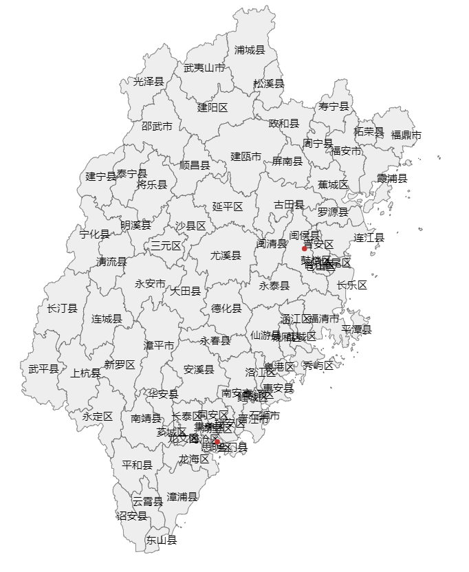

# Geojson地图

## 1 使用方法

django-echarts 支持直接引用 geojson 地图，地图来源可以线上资源提供或者自己制作。相关方法均定义在 `django_echarts.geojson` 模块。

```python
use_geojson(chart_obj, map_name:str, url:str)
```

参数说明如下：

| 参数      | 描述                                                         |
| --------- | ------------------------------------------------------------ |
| chart_obj | pyecharts中的图表                                            |
| map_name  | 地图名称，可以为任何字符串。用于 `echarts.registerMap` 的第一个参数。 |
| url       | geojson文件引用地址，该url须返回一个json格式数据             |

远程地址使用

```python
use_geojson(map1, '福建省', 'https://geo.datav.aliyun.com/areas_v3/bound/350000_full.json')
```

本地地址使用

```python
use_geojson(map1, '福建市县', '/geojson/fujian.geojson')  # 不推荐，使用下面两种的url反向解析
use_geojson(map1, '福建市县', geojson_url('fujian.geojson'))
use_geojson(map1, '福建市县', reverse_lazy('dje_geojson', args=('fujian.geojson',)))
```


## 2 本地geojson示例

### 制作geojson文件

以制作福建省市县两级边界地图为例子。

第一步，打开阿里云数据可视化平台提供的工具 [http://datav.aliyun.com/portal/school/atlas/area_selector](http://datav.aliyun.com/portal/school/atlas/area_selector) ，依次下载福建省9个地市的geojson文件（须勾选 “包括子区域”）。

第二步， 打开 [geojson.io](http://geojson.io/) 网站，导入各地市geojson文件，直接再导出合并后的geojson，文件名为 *map.geojson*。


### 编写图表代码

第一步，将 *map.geojson* 改名，名称只能包含 数字、字母、下划线、横杠等字符。

并放置在 static 目录下，具体路径为：

```
<BASE_DIR>/static/geojson/fujian.geojson
```

第二步，对图表对象调用 `use_geojson` 函数。

```python
from django_echarts.entities import Map
from django_echarts.geojson import use_geojson, geojson_url

# ...

@site_obj.register_chart
def my_geojson_demo():
    map1 = Map()
    map1.add("", [('闽侯县', 23), ('湖里区', 45)], maptype="福建市县")
    map1.set_global_opts(title_opts=opts.TitleOpts(title="自定义geojson"))
    map1.height = '800px'
    use_geojson(map1, '福建市县', geojson_url('fujian.geojson'))
    return map1
```


渲染后的前端代码如下（省略非关键代码）：

```javascript
$.getJSON("/geojson/fujian.geojson").done(function(mapdata){
    echarts.registerMap("福建市县", mapdata);
    var chart_3bf0d2a = echarts.init(
        document.getElementById('3bf0d2a'),
        'white',
        {renderer: 'canvas'}
    );
    var option_3bf0d2a = {
        "series": [
            {
                "type": "map",
                "mapType": "福建市县",
                "data": [
                    { "name": "闽侯县", "value": 23 },
                    { "name": "湖里区", "value": 45 }
                ],
            }
        ],
    };
    chart_3bf0d2a.setOption(option_3bf0d2a);
}).fail(function(jqXHR, textStatus, error){
    $("#3bf0d2a").html("Load geojson file fail!Status:" + textStatus);
});

```

### 运行效果



## 3 关于geojson_url

**1)** 在上述例子中，fujian.geojson 放在静态文件目录，但是不能在 `use_geojson` 的url参数使用 `/static/geojson/fujian.geojson`，这是因为该url由 `django.contrib.staticfiles` 处理，返回的是 `FileResponse`。

**2)** `geojson_url` 用于反向解析url。返回一个url地址，由 `GeojsonDataView` 视图处理，解析该文件并返回 `JSONResponse`。

**3)**  我们也不建议在 `use_geojson`的`url` 参数直接使用 `/geojson/fujian.geojson`，虽然在上述例子中实际url就是如此。这是因为 `GeojsonDataView` 视图是挂载到 `DJESite.urls` 之中，实际地址可能随其变化而变化 。

比如如果项目主路由配置如下：

```python
from django.urls import path, include
from ccs.site_views import site_obj

urlpatterns = [
    path('site/', include(site_obj.urls)),
]
```

则文件 fujian.geojson的引用url是 `/site/geojson/fujian.geojson`。